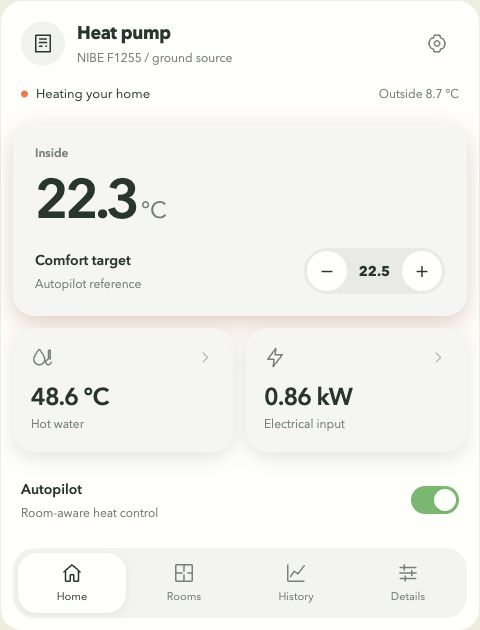

# NIBE Dashboard

A quieter Home Assistant dashboard for your heat pump. Daily comfort first; hot water, rooms and diagnostics when you need them.

Built in the [Space Hub Card](https://github.com/bitosome/space-hub-card) design language: theme-aware rounded tiles, shared typography and subtle under-tile glows. One card, one JavaScript file, no ApexCharts or other custom-card dependencies.



## What you get

- **Home:** indoor temperature, comfort target, hot-water temperature, whole-circuit electrical input and autopilot master.
- **Rooms:** each configured thermostat's current temperature, independent target and heat-request state.
- **Hot water:** cylinder readings, periodic-boost settings and electric-assistance readings. Open it from the hot-water tile.
- **History:** on-demand, native Home Assistant graphs for temperatures, electrical input and compressor frequency.
- **Details:** electrical input and controller limits, with heating/source and protection data behind expandable sections.
- **Comfort settings:** user heater allowance and manual heat trim, accessed through the gear button.
- **Visual editor:** explicit entity mappings, room selection, controller-health watches and read-only mode.

The normal view is deliberately not a wall of technical gauges. Alarm and controller warnings remain visible whichever section is open.

## Install

### HACS

This is a **custom repository**, not an entry in the default HACS catalog. The GitHub repository must be public: [HACS does not support private repositories](https://www.hacs.xyz/docs/faq/private_repositories/).

1. In HACS, open **Custom repositories**.
2. Add `https://github.com/bitosome/nibe-dashboard`, category **Dashboard**.
3. Download **NIBE Dashboard** and reload the frontend.
4. Verify the resource `/hacsfiles/nibe-dashboard/nibe-dashboard.js` is registered as a **JavaScript module**.
5. Add the **NIBE Dashboard** card using the visual card picker, or use the YAML below.

The bundle is committed in `dist/` and attached to tagged releases, following the [HACS dashboard repository requirements](https://www.hacs.xyz/docs/publish/plugin/).

### Manual installation

1. Download `nibe-dashboard.js` from a release, or use `dist/nibe-dashboard.js` from the repository.
2. Put it in `/config/www/nibe-dashboard.js`.
3. Add `/local/nibe-dashboard.js?v=0.1.0` as a dashboard resource of type **JavaScript module**.
4. Reload the frontend and add the card. After an upgrade, update the cache-busting version if needed.

Installation does not create helpers or automations, enable NIBE entities, or replace any existing dashboard.

## Quick start

```yaml
type: custom:nibe-dashboard
title: Heat pump
subtitle: NIBE / ground source
```

Defaults match conventional NibeGW F-series entity IDs and the companion autopilot helper names. Missing entities are shown as unavailable, never as zero. Use the editor to map your actual entities; suffixes can differ between installations. This card is not a universal register map for every NIBE model.

```yaml
type: custom:nibe-dashboard
title: Heat pump
entities:
  indoor: sensor.house_temperature
  target: input_number.heating_comfort_target
  autopilot: input_boolean.heating_autopilot
  heater_cap: input_number.heating_heater_allowance
  bias: input_number.heating_trim
  circuit_power: sensor.heat_pump_electrical_power
rooms:
  - entity: climate.living_room
    name: Living room
  - entity: climate.bedroom
    name: Bedroom
watch_automations:
  - automation.heat_controller
  - automation.compressor_governor
history_hours: 24
```

These are **generic examples**, not a production configuration. Configure only the relevant thermostats, helpers and automations. Rooms are never discovered automatically, and the master switch alone does not prove the controller automations are running. Select those automations in the editor to enable health warnings.

For a pump without the companion autopilot, remove its helper mappings and use the card for monitoring:

```yaml
type: custom:nibe-dashboard
read_only: true
entities:
  target: null
  autopilot: null
  heater_cap: null
  bias: null
  ready_zones: null
  warm_guard: null
  global_hold: null
  condenser_hold: null
  allowance: null
  mains_fresh: null
```

`null` explicitly removes a mapping; an omitted role uses its default. Do not disable the alarm mapping merely to hide a missing-data warning: map a working alarm-code sensor.

## Configuration

| Option | Default | Purpose |
| --- | --- | --- |
| `type` | Required | `custom:nibe-dashboard` |
| `title` | `Heat pump` | Card title |
| `subtitle` | `NIBE / room-aware comfort` | Small identity line |
| `read_only` | `false` | Disable every command issued by this card |
| `entities` | Standard mappings | Role-to-entity mapping; use `null` to remove a role |
| `rooms` | `[]` | Explicit list of `{entity: climate.example, name: Optional label}` |
| `watch_automations` | `[]` | Warn if listed controller automations are off or unavailable |
| `history_hours` | `24` | Integer from 1 to 168 |

See [entity roles and defaults](examples/entity-roles.md) for the complete mapping. Every role is configurable in the visual editor. Extra/unknown role names and wrong entity domains are rejected so typos do not silently change controls.

### Control contract

| Control | Allowed domain | Action |
| --- | --- | --- |
| House target | `input_number` | `set_value`, using reported min/max/step |
| Heater user allowance | `input_number` | `set_value`, using reported min/max/step |
| Manual heating trim | `input_number` | `set_value`, using reported min/max/step |
| Autopilot master | `input_boolean` | Explicit `turn_on` / `turn_off` |
| Room target | `climate` | `set_temperature`, no operating-mode changes |

Only an explicit user gesture sends a service call. No commands run on card load, a timer, a state update or a history request. Pending requests lock the controls until the service succeeds **and** the entity reports the requested value. After 15 seconds without confirmation, the card reports uncertainty and does not retry. A confirmed HA setting does not prove physical pump operation.

Room adjustments require an available, non-off thermostat exposing `temperature`, `min_temp`, `max_temp`, `target_temp_step` and the target-temperature supported feature. Missing constraints disable adjustment rather than guessing. The house target does not rewrite individual room targets.

The card does **not** install the backend autopilot. Its controller automations must enforce electrical allowances, fault holds and flow-related constraints independently of the dashboard. This card never writes raw NIBE `number`, `select` or `switch` entities. Their diagnostic rows do not open editable more-info dialogs. It never disables the compressor governor, changes operating mode, resets alarms, forces a boost or edits hot-water safety settings.

Read-only is a presentation preference, not authorization or a security boundary. Home Assistant permissions remain authoritative.

## Honest telemetry

- **Input power is not produced heat.** Whole-circuit power can include pumps and auxiliaries; the compressor input sensor does not. No thermal output or COP is calculated from electrical input. This version intentionally omits thermal-output analytics until a valid measurement source is established.
- **Permission is not consumption.** The controller heater cap and available electrical allowance are limits. NIBE decides when to run the heater.
- **Requested heat is not measured flow.** A thermostat's `hvac_action: heating` reflects relay demand. Neither this nor a delayed zone count proves an actuator opened or adequate water flow exists.
- **Limits are not hardware cutoffs.** A calculated supply ceiling is a target limit. A compressor-frequency cap is not actual frequency.
- **Alarm 181 remains actionable.** A hot BT7, cleared alarm, enabled periodic schedule or heater permission is not evidence that a hygiene cycle completed. Verify the actual cycle on the pump and investigate failures. The card makes no success inference and offers no alarm-reset shortcut.
- **Unknown is not zero.** Unavailable sensors remain unavailable. Recorder gaps are handled by Home Assistant's native history card. No freshness is inferred from an unchanged value.

Units are taken from entity attributes. Use correctly scaled power sensors with W/kW metadata. Configure `circuit_power` to a meter for the heat-pump circuit, not the whole house. Sensor rows in Details open Home Assistant's normal more-info history. Raw register rows remain read-only.

## One-place dashboard

The component is a **card**, not a dashboard replacement script. Use the [single-view example](examples/single-view.yaml) to host it in one place. Back up your existing view before replacing it; do not deploy both the old technical stack and the new card if the goal is a clean single page. There is no production URL or household mapping in this repository.

## Develop and verify

```sh
npm ci
npm run check
npm run preview
```

Open `http://127.0.0.1:5187`. The preview uses synthetic readings and mocked services only. It offers light/dark, 320-pixel/wide layouts, heating/DHW/standby, alarm 181, missing data, disconnection, service failure and read-only scenarios. Native history is only available inside HA; the preview explains that limitation rather than displaying fabricated history.

The tests exercise the **actual release bundle** against a mocked Home Assistant host. They cover command boundaries, acknowledgements, bounds, failure/offline states, rooms, alarms, native-history lifecycle and editor mappings. Real Home Assistant rendering and physical heat-pump operation still require separately authorized deployment checks.

Rebuild and commit `dist/nibe-dashboard.js` with each source change. CI checks the bundle matches its source. Tag `vX.Y.Z` matching `package.json`; the release workflow runs the checks again and publishes the tested bundle. Bundled dependencies are pinned in `package-lock.json`.

## Attribution

MIT. Shared design tokens come from Space Hub Card; see [provenance](src/shared/PROVENANCE.md) and [LICENSE](LICENSE). Not an official NIBE product and not a substitute for the pump's safety controls, installer guidance or validated hygiene procedures.
